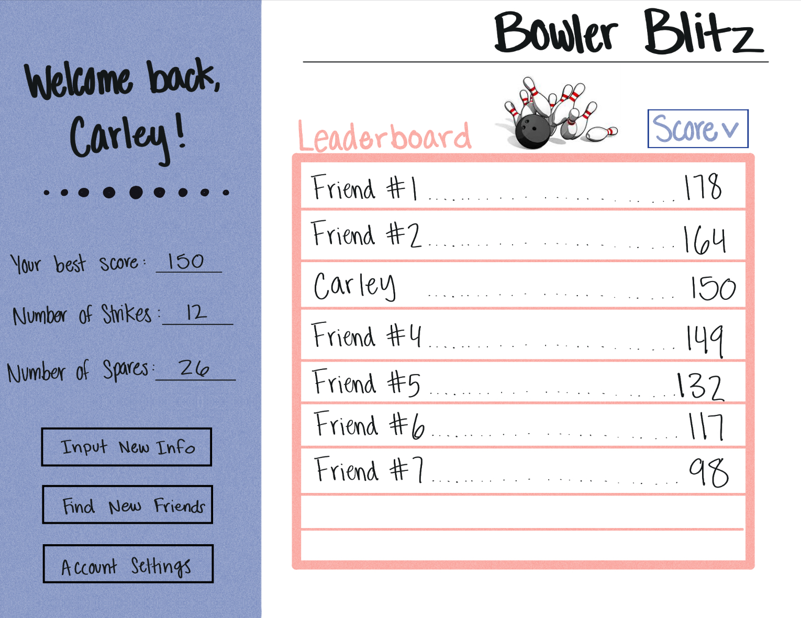

# startup2024
## Specification Deliverable

### Elevator Pitch 
Introducing _BowlerBlitz_—your new go-to for sharing bowling scores and connecting with friends! Track your strikes, compare scores, and celebrate every spare with this website. Elevate your game and keep the fun rolling with BowlerBlitz—where every pin is a win!
### Design v1

### Key Features
- Login Authentication
- Scoreboard of people you 'friend'
- Ability to change the way it's ordered
  - Via score, number of strikes, or number of spares
- Stores all your bowling data
- (Hopefully) Ability to react to friends' scores

### Technologies

- **HTML**
  - Use HTML structure for the content of the application and inputing data.
- **CSS**
  - Making the HTML elements look good, using good color contrast and good use of whitespace.
- **React**
  - Building the interactive user interfaces and applying reactions to others' scores.
- **Service**
  - Backend service for logging in, inputting scores, and retrieving scoreboard order.
- **DB/Login**
  - Stores users, scores, their friends. You can't compete with your friends without logging in. 
- **WebSocket**
  - See reactions to your scores and if you move places on the scoreboard.

  ### HTML deliverable

For this part I made the structure of my application using HTML.

- [x] **HTML pages** - Two HTML page that represent the ability to login and input your bowling stats.
- [x] **Links** - The login page automatically links to the stats page. 
- [x] **Text** - You can see an example of the leaderboard with the bowling scores.
- [ ] **Images** - I added an image of a bowling cartoon.
- [x] **DB/Login** - Input box and submit button for login. The bowling scores represent data pulled from the database.
- [x] **WebSocket** - The leaderboard of scores represents the stats of realtime friends.
